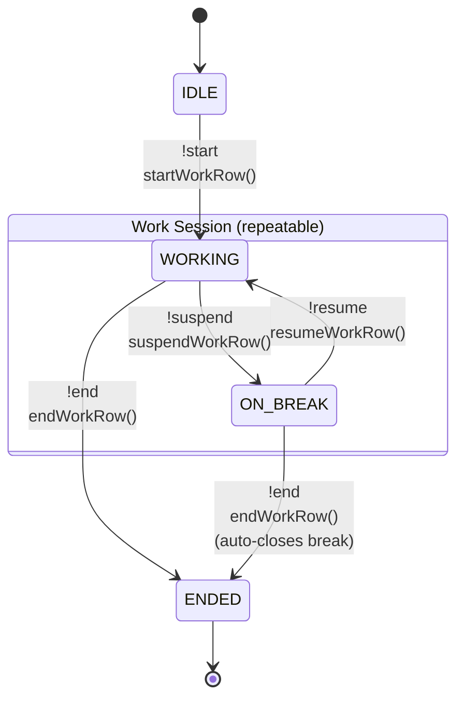

# discord-kintai-bot

## Command

The following is a list of commands supported by kintai-bot, which only work on the text channel named `<org-name>-kintai` or `<org-name>`

| Command | Description |
|---------|-------------|
| `!start` | Starts recording attendance records and creates a discord thread for control |
| `!suspend` | Change work status to resting |
| `!resume` | Change work status to working |
| `!end` | Stops recording attendance records and calculate a daily summary |

## State Machine

### State Diagram



| State | Condition | Description |
|-------|-----------|-------------|
| IDLE | No SheetRow for today | Initial state, no work record exists |
| WORKING | `startTime` set, no open break | Actively working |
| ON_BREAK | Last `breakTimeRecord` has no `endTime` | Taking a break |
| ENDED | `endTime` set | Work session completed |

## Requirements

### Environment Variables

| Variable | Required | Default |
|----------|----------|---------|
| `DISCORD_BOT_TOKEN` | Yes | - |
| `GOOGLE_SERVICE_ACCOUNT_CREDENTIALS_PATH` | No | `/etc/discord-kintai-bot/google_service_account_credentials.json` |
| `ORG_TO_SHEET_ID_CONF_PATH` | No | `/etc/discord-kintai-bot/org_to_sheet_id.json` |

### Config File

| File | Description |
|------|-------------|
| `google_service_account_credentials.json` | Service account credentials for accessing Google Spreadsheet |
| `org_to_sheet_id.json` | Mapping discord channel name (org name) to Google Spreadsheet id. Channel name must be `<org-name>-kintai` or `<org>` |

## Systemd

setup stable node
```bash
$ sudo apt install -y nodejs npm
$ sudo npm install n -g
$ sudo n stable
$ sudo apt purge -y nodejs npm
$ exec $SHELL -l
$ node -v
```

setup discord-kintai-bot service
```bash
$ git clone git@github.com:terakoya76/discord-kintai-bot.git
$ cd discord-kintai-bot
$ sudo npm i -g pnpm
$ pnpm install --frozen-lockfile

# set config
$ sudo mkdir /etc/discord-kintai-bot
$ sudo vim /etc/discord-kintai-bot/google_service_account_credentials.json
$ sudo vim /etc/discord-kintai-bot/org_to_sheet_id.json

# set systemd unitfile
$ sudo cp systemd/discord-kintai-bot.service /usr/lib/systemd/system/.

# edit Environment
$ sudo vim /usr/lib/systemd/system/discord-kintai-bot.service

$ sudo systemctl daemon-reload
$ sudo systemctl enable discord-kintai-bot.service
```
